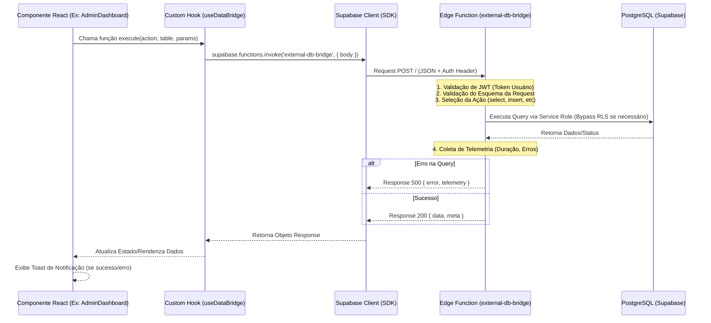

# Guia de Arquitetura e Documentação Técnica

## 1. Fluxo de Dados (Diagrama de Sequência)

Este diagrama ilustra a jornada de uma requisição desde a interface do usuário até a execução na Edge Function e o retorno dos dados.



---

## 2. Estrutura do Projeto

### Mapa de Pastas e Responsabilidades
```text
/src
 ├── components/         # Componentes UI reutilizáveis (Shadcn/UI)
 ├── features/           # Módulos de negócio (Domínios)
 │   ├── auth/           # Login, RBAC, Provedores de Autenticação
 │   ├── admin/          # Painéis de controle, Auditoria, Logs
 │   └── [modulo]/       # Pasta padrão: components/, hooks/, services/
 ├── integrations/       # Configurações externas (Supabase Client, Tipos DB)
 ├── lib/                # Utilitários puros (formatters, validações)
 ├── services/           # Camada de comunicação com APIs externas
 └── hooks/              # Hooks globais (useToast, useTheme)

/supabase
 ├── functions/          # Edge Functions (Deno Deploy)
 │   └── external-db-bridge/ # Bridge central para operações complexas
 └── migrations/         # Scripts SQL de evolução do banco
```

### Camadas do Sistema
1.  **Apresentação (UI):** React + Tailwind + Lucide Icons. Focada em estado visual e experiência do usuário.
2.  **Lógica de Negócio (Hooks):** Gerencia `react-query` para cache, sincronização e estados assíncronos.
3.  **Infraestrutura (Supabase):** Persistência de dados, autenticação via JWT e armazenamento de arquivos.
4.  **Backend (Edge Functions):** Processamento que exige `Service Role` (bypass RLS) ou integrações seguras com APIs de terceiros.

---

## 3. Contrato da Edge Function `external-db-bridge`

Esta função atua como um proxy seguro para operações de banco de dados que exigem privilégios elevados ou monitoramento detalhado (telemetria).

### Request Format (POST)
Endpoint: `POST /functions/v1/external-db-bridge`

```json
{
  "action": "select" | "insert" | "update" | "delete" | "rpc" | "upsert",
  "table": "nome_da_tabela", // Obrigatório para não-RPC
  "rpc": "nome_da_funcao",   // Obrigatório para action "rpc"
  "params": {
    "columns": "*",          // Opcional para select
    "limit": 100,            // Opcional
    "offset": 0,             // Opcional
    "data": { ... },         // Usado em insert/update/upsert
    "match": { "id": "..." } // Filtro para update/delete
  }
}
```

### Response Format (JSON)
*   **Sucesso (200 OK):**
    ```json
    {
      "data": [ ... ],
      "meta": { 
        "duration_ms": 150, 
        "record_count": 10, 
        "severity": "normal" 
      }
    }
    ```
*   **Erro (400/500):**
    ```json
    {
      "error": "Descrição detalhada do erro",
      "telemetry": { 
        "severity": "error", 
        "duration_ms": 45 
      }
    }
    ```

### Monitoramento e Telemetria
A função registra automaticamente em `query_telemetry` qualquer operação que:
- Resulte em erro (`severity: "error"`)
- Demore mais de 3 segundos (`severity: "slow"`)
- Demore mais de 8 segundos (`severity: "very_slow"`)

---

## 4. Padrões Obrigatórios de Uso (External DB Bridge)

Para manter a consistência e segurança, todos os novos desenvolvimentos devem seguir estes padrões:

### 1. Nomenclatura de Parâmetros
- Use `snake_case` para nomes de colunas e parâmetros RPC.
- Sempre defina um `limit` em operações de `select` para evitar payloads massivos.

### 2. Tratamento de Erros Padronizado
A Bridge retorna erros no formato `{ error: string, telemetry: object }`. Nunca exponha stack traces brutos para o frontend; a Bridge já higieniza as mensagens de erro do PostgreSQL.

### 3. Tabelas Permitidas
Atualmente, as seguintes tabelas possuem suporte otimizado:
- `job_status_audit`
- `machine_event_audit`
- `query_telemetry`
- `production_losses`

### 4. Exemplo de Implementação de Referência (TypeScript)

```typescript
// Padrão de Chamada para Novo Desenvolvedor
const callBridge = async (action: string, table: string, data: any) => {
  const { data: response, error } = await supabase.functions.invoke('external-db-bridge', {
    body: { action, table, params: { data } }
  });

  if (error) {
     console.error("Erro na Bridge:", error.message);
     throw new Error("Falha na comunicação com o banco externo");
  }

  return response.data;
};
```

---

## 5. Exemplos de Chamadas Reais

### Exemplo: Buscar Logs de Auditoria via Hook
```typescript
const { data, error } = await supabase.functions.invoke('external-db-bridge', {
  body: {
    action: 'select',
    table: 'job_status_audit',
    params: {
      columns: '*, profiles:changed_by(full_name)',
      limit: 20
    }
  }
});
```

### Exemplo: Executar RPC (Procedure)
```typescript
const { data, error } = await supabase.functions.invoke('external-db-bridge', {
  body: {
    action: 'rpc',
    rpc: 'calculate_efficiency_metrics',
    params: {
      machine_id: 'machine-123'
    }
  }
});
```
